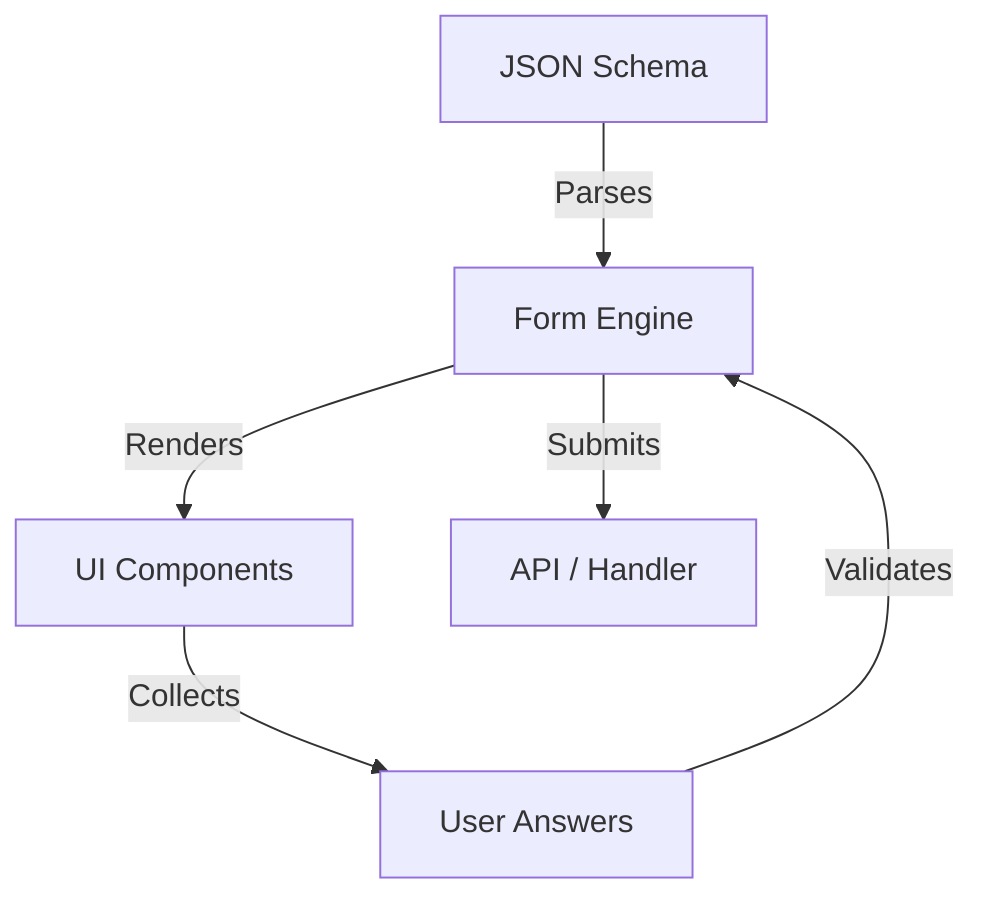

# Introduction

**Sawabona Forms** is a high-performance, schema-driven form builder designed to create conversational, Typeform-like experiences with zero boilerplate. 

Built by **Sawabona Tech**, it embodies our philosophy of "vibe coding": tools that feel alive, look premium, and just work.

## Why Sawabona Forms?

Building complex, multi-step forms usually involves:
- Managing complex state (Redux, Context, Zustand...)
- Handling validation logic (Zod, Yup...)
- creating animations and transitions
- Ensuring accessibility (WCAG)
- Making it responsive

**Sawabona Forms** solves this by abstracting everything into a **JSON Schema**. You define *what* you want, and the engine handles *how* it renders.

## Key Features

### 🎨 Design & Theming
- **Themable Engine**: Complete control over colors, fonts, and spacings via a simple theme object.
- **Dark Mode Support**: Built-in support for light and dark modes.
- **Micro-interactions**: Subtle animations powered by Framer Motion.

### ⚡ Performance
- **Headless Core**: Built on top of Radix UI for accessibility and Framer Motion for performance.
- **Tiny Bundle**: <50kb gzipped.
- **Lazy Loading**: Components are loaded only when needed.

### 🛡️ Developer Experience
- **TypeScript Native**: Full type safety for schemas and themes.
- **Schema Validation**: Your forms are validated against a strict schema to prevent runtime errors.
- **Developer Playground**: Test your schemas in real-time in our [Playground](/docs/playground).

## Architecture

Sawabona Forms uses a "One Question at a Time" approach. This reduces cognitive load for users and drastically increases completion rates compared to traditional long forms.

