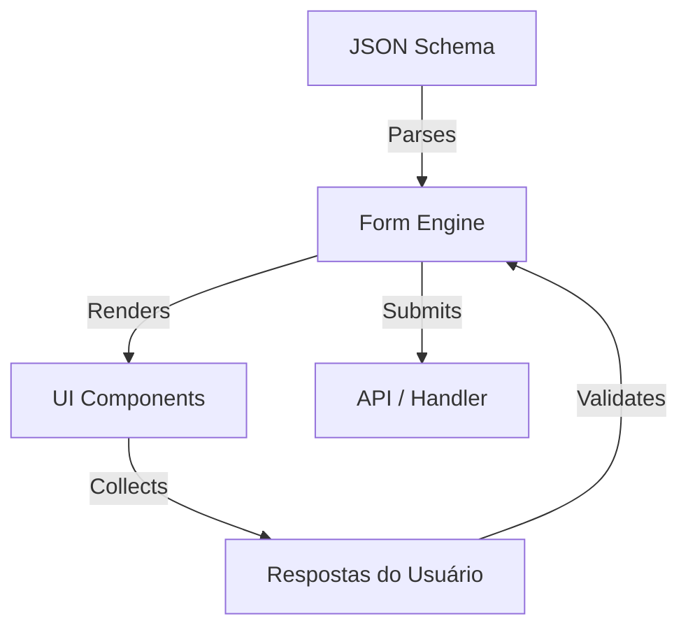

# Introdução

**Sawabona Forms** é um construtor de formulários de alta performance, baseado em schema, projetado para criar experiências conversacionais estilo Typeform com zero boilerplate.

Feito pela **Sawabona Tech**, ele incorpora nossa filosofia de "vibe coding": ferramentas que parecem vivas, têm visual premium e simplesmente funcionam.

## Por que Sawabona Forms?

Criar formulários complexos e multi-etapas geralmente envolve:
- Gerenciar estado complexo (Redux, Context, Zustand...)
- Lidar com validação (Zod, Yup...)
- Criar animações e transições na mão
- Garantir acessibilidade (WCAG)
- Fazer funcionar no mobile

**Sawabona Forms** resolve isso abstraindo tudo em um **JSON Schema**. Você define *o que* você quer, e o motor cuida de *como* renderizar.

## Principais Funcionalidades

### 🎨 Design & Temas
- **Motor de Temas**: Controle total sobre cores, fontes e espaçamentos via um objeto simples.
- **Dark Mode**: Suporte nativo para modos claro e escuro.
- **Micro-interações**: Animações sutis powered by Framer Motion.

### ⚡ Performance
- **Core Headless**: Construído sobre Radix UI para acessibilidade total e Framer Motion para performance.
- **Bundle Minúsculo**: <50kb gzipped.
- **Lazy Loading**: Componentes carregados apenas quando necessários.

### 🛡️ Developer Experience (DX)
- **TypeScript Nativo**: Type safety total para schemas e temas.
- **Validação de Schema**: Seus forms são validados contra um schema estrito para prevenir erros em runtime.
- **Playground**: Teste seus schemas em tempo real no nosso [Playground](/docs/playground).

## Arquitetura

Sawabona Forms usa uma abordagem de "Uma Pergunta por Vez". Isso reduz a carga cognitiva do usuário e aumenta drasticamente as taxas de conclusão comparado a formulários tradicionais (linguição).

